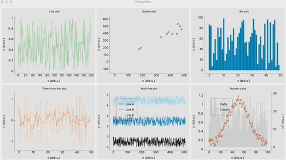
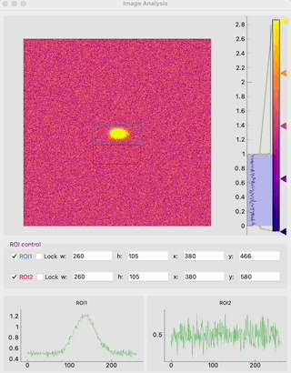

foamgraph
=========

[](https://pypi.org/project/foamgraph/)

[](https://lgtm.com/projects/g/zhujun98/foamgraph/alerts/)
[](https://lgtm.com/projects/g/zhujun98/foamgraph/context:python)


[](https://doc.qt.io/qt-5/)
[](https://doc.qt.io/qt-6/)

`foamgraph` was originally developed as part of the online analysis framework 
[EXtra-foam](https://github.com/European-XFEL/EXtra-foam.git)
to provide fast display (10 Hz) and interactive data analysis for photon science
experiments at the state-of-art free-electron laser (FEL) facility - European XFEL.
It was implemented on top of the famous Python graphics and GUI library
[PyQtGraph](https://github.com/pyqtgraph/pyqtgraph). The following features make 
`foamgraph` stand out:

- The widgets and graphics objects are dedicated for photon science experiments.
- The performance has been significantly improved.
- It trades flexibility for an easy-to-use and unified API.

It must be emphasized that `foamgraph` is only a GUI library. It does not provide
any interfaces for data and metadata exchange between the backend and the GUI because
it is facility and experiment specific.

Nevertheless, when integrating GUI into a real-time data analysis pipeline, 
there are a couple of things to be taken into account:
- The GUI in principle should not perform any number crunching jobs, otherwise it 
will be slowed down because it is written in Python.
- Light computation tasks can be performed in a Python thread and the communication 
between the GUI and the processor can still be fulfilled using Qt's signal-slot connections.

## Getting started

Every plot widget should inherit from `PlotWidgetF`. The following code snippet
shows how to create a double-y plot with a title, axis labels and a legend:

```py
from foamgraph import FColor, PlotWidgetF


class DoubleYPlot(PlotWidgetF):
    def __init__(self, *, parent=None):
        super().__init__(parent=parent)

        self.setTitle('Double-y plot')
        self.setXYLabels("x (arb. u.)", "y (arb. u.)", y2="y2 (arg. u.)")

        self._plot = self.plotCurve(label="Data", pen=FColor.mkPen('w'))
        self._plot2 = self.plotBar(
            label="Count", y2=True, brush=FColor.mkBrush('i', alpha=150))
        self.addLegend()

    def updateF(self, data):
        """Override."""
        self._plot.setData(data['x'], data['y'])
        self._plot2.setData(data['x'], data['y2'])
```

Every widget for image analysis should inherit from `ImageViewF`. The following
code snippet shows how to create a simple widget for displaying an image:

```py
from foamgraph import ImageViewF


class ImageAnalysis(ImageViewF):
    def updateF(self, data):
        """Override."""
        self.setImage(data['image']['data'])
```

## Examples

* Open a terminal and start the producer:

```sh
python examples/producer.py
```

* Open another terminal and start the plot gallery example

```sh
python examples/plot_gallery.py
```



* Open another terminal and start the image analysis example

```sh
python examples/image_analysis.py
```


